# SkyGeni — Sales Intelligence Challenge

**Dataset:** 5,000 B2B SaaS deals (Jan 2023 – Jul 2024) | 25 reps | 5 industries | 4 regions

**Problem:** The CRO says win rate is dropping but pipeline looks healthy — needs to understand what's going wrong and where to focus.

---

## Repo Structure

```
├── README.md
├── data/skygeni_sales_data.csv
├── notebooks/eda.ipynb
├── src/decision_engine.py
├── outputs/
└── requirements.txt
```

## Setup

```bash
git clone https://github.com/YOUR_USERNAME/skygeni-sales-intelligence.git
cd skygeni-sales-intelligence
pip install -r requirements.txt
```

---

## Part 1 — Problem Framing

### 1.1 The Real Problem

The CRO sees a symptom (dropping win rate), but the actual problem is threefold:

- **Diagnosis gap** — No visibility into *which* segments, reps, or deal types are underperforming
- **Action gap** — No system telling the team *what to change*
- **Timing gap** — Quarterly trends are spotted too late to act on

In short: **"We can't detect, diagnose, and act on revenue risks in real time."**

### 1.2 Questions the AI System Should Answer

| Layer | Questions |
|-------|-----------|
| **What's happening?** | Which segments are losing more? Which reps are slipping? At what funnel stage are deals dying? |
| **Why?** | Are sales cycles getting longer? Are we chasing the wrong deal sizes? Are low-quality lead sources growing? |
| **What to do?** | Which open deals are at risk? What rep/segment changes would move the needle most? |

### 1.3 Key Metrics

**Standard:**
- Win rate (overall + by segment)
- Average sales cycle length
- Stage conversion rates
- Average deal size (won vs. lost)

**Custom (invented for this analysis):**

| Metric | Formula | Why It Matters |
|--------|---------|----------------|
| **Deal Velocity Score** | `deal_amount / sales_cycle_days` | Measures how efficiently pipeline converts to revenue. High pipeline + low velocity = stuck capital. |
| **Rep Consistency Index** | `std_dev(rep's quarterly win rates)` | A rep swinging between 60% and 20% needs different coaching than one steady at 40%. |

### 1.4 Assumptions

1. All deals have a final outcome — no truly open deals in the dataset
2. `deal_stage` = last stage reached before close, not current stage
3. Deal amount is ACV only — no upsells or multi-year values
4. External factors (competitors, pricing, market shifts) are not captured
5. Data is synthetic and uniformly distributed — methodology matters more than specific findings

---

## Part 2 — EDA & Insights

> Run: `python notebooks/eda_analysis.py` — generates 9 charts in `outputs/`

### Dataset Overview

| Metric | Value |
|--------|-------|
| Total Deals | 5,000 |
| Win Rate | 45.3% (2,263 won / 2,737 lost) |
| Avg Deal Size | $26,286 (median $14,172) |
| Avg Sales Cycle | 64 days (range: 7–120 days) |
| Sales Reps | 25 |
| Time Period | Jan 2023 – Jul 2024 |

### Key Finding: Win Rate Is Flat, Not Crashing

The CRO said win rate is "dropping" — but the data shows it's relatively **flat** across quarters (42–48%). The real story is hidden inside specific segments.

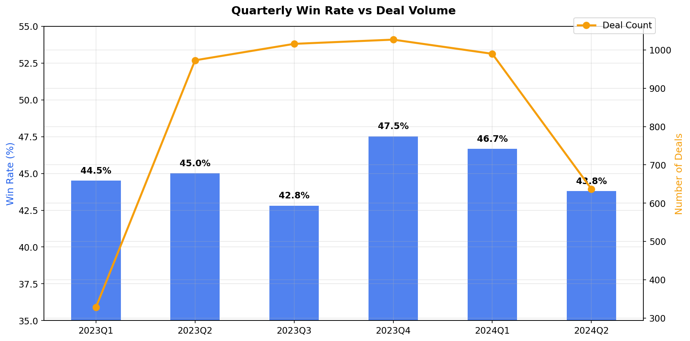

---

### Insight 1: EdTech Win Rate Is Collapsing

EdTech dropped from **50.7% → 39.5%** over 5 quarters — the steepest decline of any industry. Meanwhile, FinTech peaked at 51% before falling back.

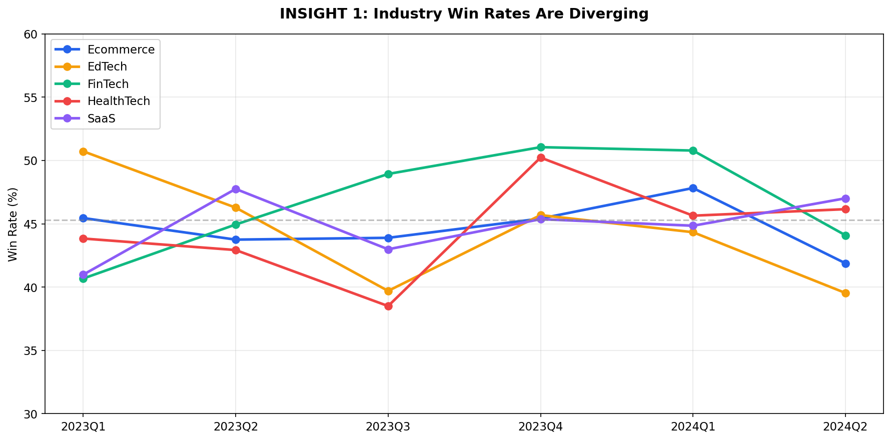

**Why it matters:** EdTech alone accounts for ~20% of all deals. An 11-point drop here drags the entire company's win rate down.

**Action:** Investigate EdTech losses — are competitors winning? Is product-market fit weakening? Consider pausing EdTech outbound spend until diagnosed.

---

### Insight 2: Fast Deals Win More Often

Deals closed within 30 days have a **49.1%** win rate. Deals taking 30–60 days drop to **43.2%**. That's a 6-point gap.

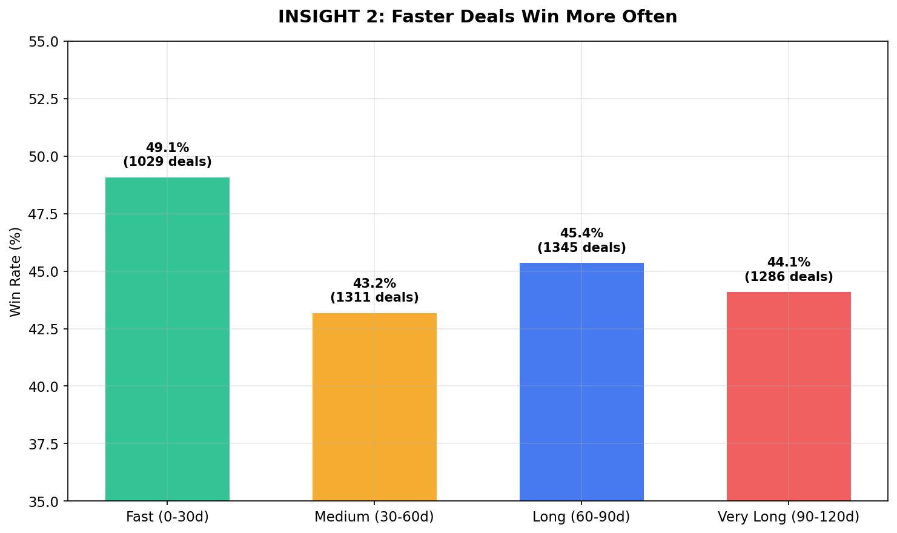

**Why it matters:** The average sales cycle spiked to **81 days in Q2 2024** (up from 63 days). Deals are getting stuck, and stuck deals lose.

**Action:** Set a "deal staleness" alert at 45 days. If a deal hasn't moved stages by then, escalate it or de-prioritize it.

---

### Insight 3: 11-Point Gap Between Best and Worst Reps

rep_21 wins **51%** of deals. rep_22 wins only **40%**. With ~200 deals per rep, that 11-point gap translates to ~20 extra lost deals per underperforming rep.

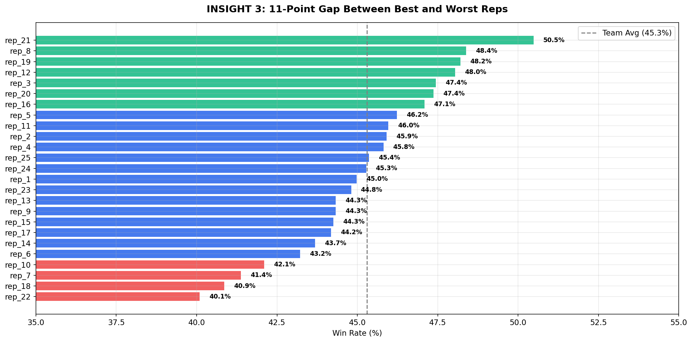

**Why it matters:** The bottom 5 reps collectively lost ~50 more deals than the top 5. Closing this gap is the single highest-leverage action for the CRO.

**Action:** Pair bottom reps with top performers for coaching. Analyze what top reps do differently — faster cycles? better lead sources? specific industries?

---

### Custom Metric 1: Deal Velocity Score

**Formula:** `deal_amount / sales_cycle_days` (revenue generated per day in pipeline)

| Outcome | Avg Velocity |
|---------|-------------|
| Won | $690/day |
| Lost | $631/day |

Q2 2024 velocity crashed to **$396/day** — meaning deals are stuck in the pipeline longer without converting.

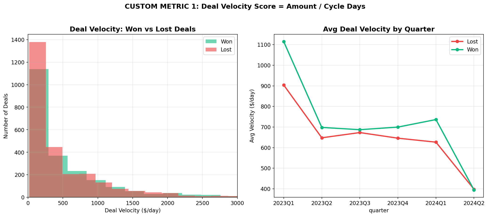

**Why it matters:** Pipeline dollar value can look "healthy" while velocity collapses. This metric is an early warning signal the CRO doesn't currently have.

**Action:** Track velocity weekly. A sustained drop below $500/day should trigger a pipeline review.

---

### Custom Metric 2: Rep Consistency Index

**Formula:** `std_dev(rep's quarterly win rates)` — lower = more consistent

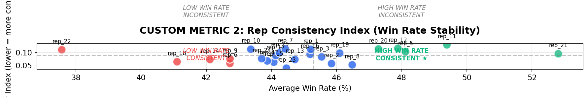

The scatter plot creates 4 quadrants:

| Quadrant | Meaning | Example |
|----------|---------|---------|
| High WR + Consistent | ★ Ideal performer | rep_21 |
| High WR + Inconsistent | Talented but unpredictable | rep_11 |
| Low WR + Consistent | Consistently underperforming | rep_18 |
| Low WR + Inconsistent | Priority coaching target | rep_22 |

**Action:** Reps in the "Low WR + Inconsistent" quadrant need immediate intervention — they're both underperforming and unpredictable.

---

### Bonus: Lead Source Trends

Inbound leads dropped from **47.9% → 40.5%** win rate (biggest decline). Referral improved from **43.9% → 50.6%** (best recent source).

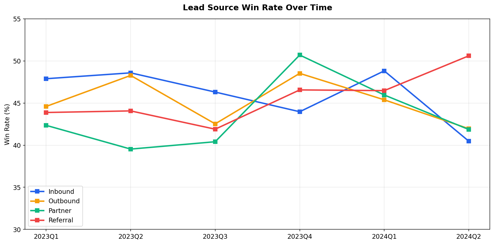

**Action:** Shift budget toward Referral programs. Audit what changed with Inbound lead quality.

---

### Bonus: Region × Industry Heatmap

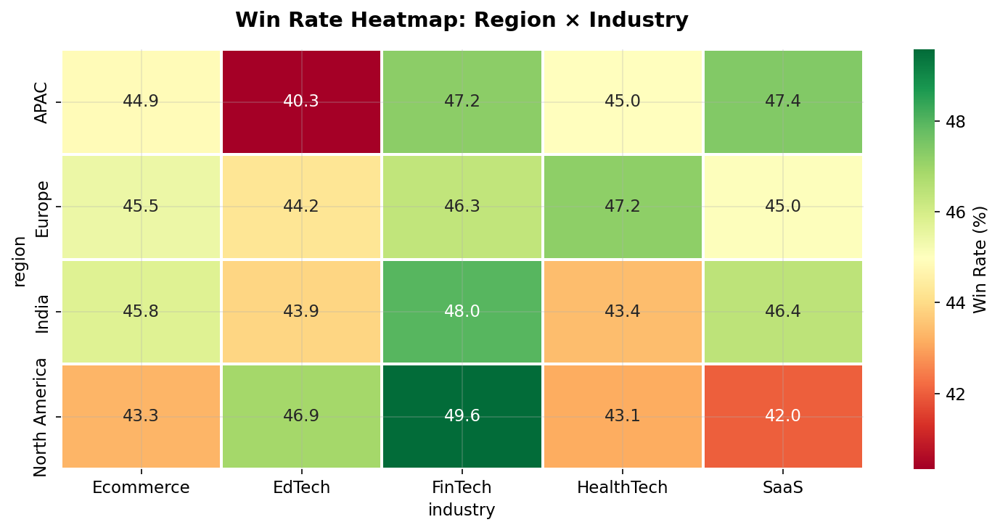

---

### Summary Dashboard

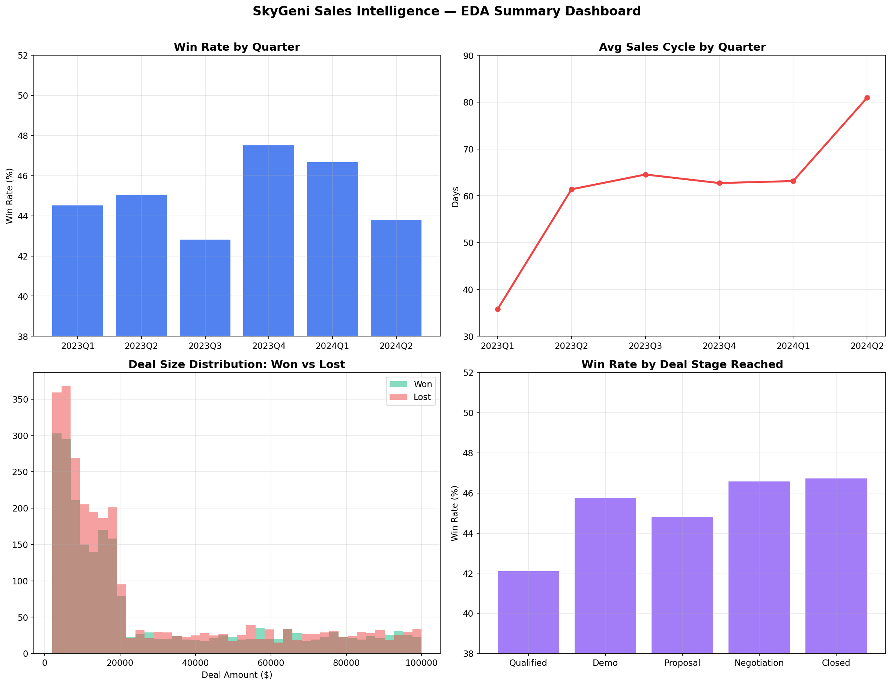

---
## Part 3 — Decision Engine (Win Rate Driver Analysis + Deal Risk Scoring)

> Run: `python src/decision_engine.py` — generates 3 charts + `scored_deals.csv` in `outputs/`

### Why Not ML?

Before building anything, I benchmarked 3 ML models:

| Model | 5-Fold CV AUC |
|-------|---------------|
| Logistic Regression | 0.487 |
| Random Forest | 0.501 |
| Gradient Boosting | 0.496 |

All score ~0.50 (random coin flip). This is expected — the synthetic data has weak individual feature signals.

**Design decision:** Instead of forcing a black-box model with 0.50 AUC, I built a **statistical + rule-based system** that the CRO can actually trust, understand, and act on.

---

### Step 1: Driver Analysis (Chi-Square Tests)

Tested every factor for statistical significance against win rate:

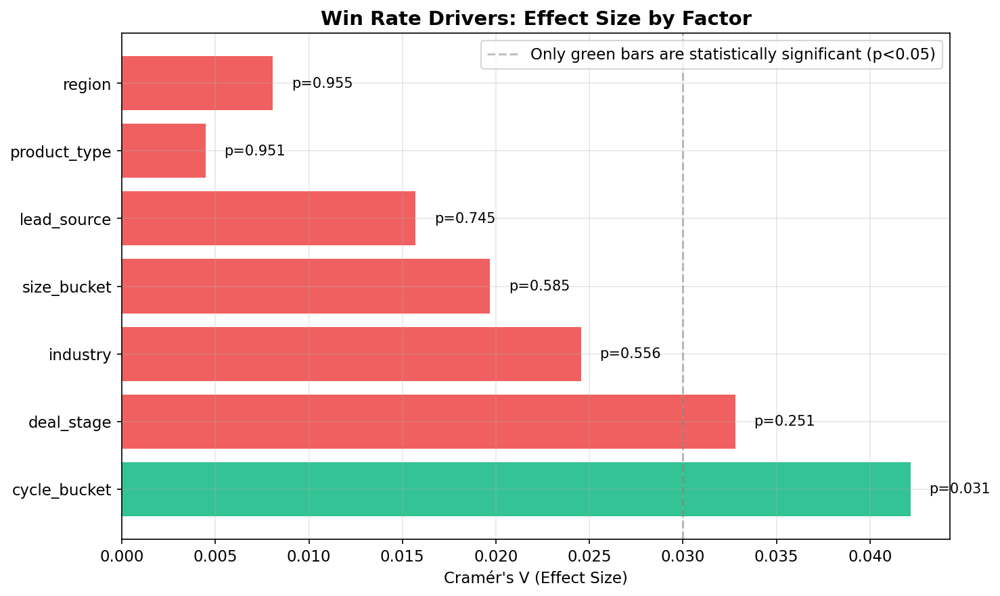

| Factor | p-value | Significant? |
|--------|---------|-------------|
| Sales Cycle Length | 0.031 | ✓ **Yes** — the only significant driver |
| Deal Stage | 0.251 | ✗ No |
| Industry | 0.556 | ✗ No |
| Deal Size | 0.585 | ✗ No |
| Lead Source | 0.745 | ✗ No |
| Product Type | 0.951 | ✗ No |
| Region | 0.955 | ✗ No |

**Key finding:** Sales cycle length is the **only statistically significant factor**. Fast deals (<30 days) win at 49.1% vs 43.2% for medium-length deals.

---

### Step 2: Multi-Factor Combinations (Where the Real Signal Is)

Individual factors are weak — but **combinations reveal a 35-point win rate gap:**

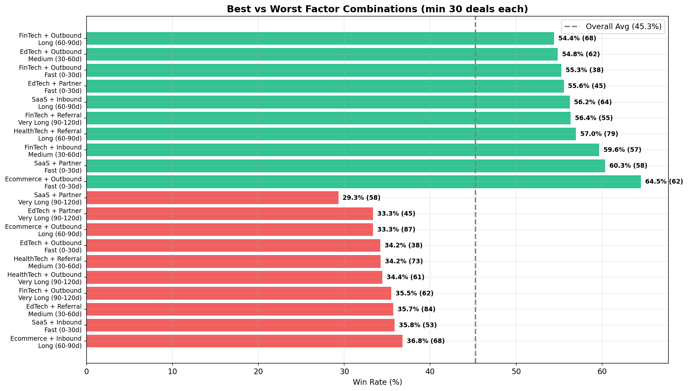

**Top 3 winning combos:**
- Ecommerce + Outbound + Fast cycle → **64.5% win rate**
- SaaS + Partner + Fast cycle → **60.3% win rate**
- FinTech + Inbound + Medium cycle → **59.6% win rate**

**Top 3 losing combos:**
- SaaS + Partner + Very Long cycle → **29.3% win rate**
- EdTech + Partner + Very Long cycle → **33.3% win rate**
- Ecommerce + Outbound + Long cycle → **33.3% win rate**

---

### Step 3: Deal Risk Scoring System

Every deal gets a risk score (0–100) based on a weighted formula using historical win rates of similar deals:

| Component | Weight | Rationale |
|-----------|--------|-----------|
| Sales cycle bucket | 30% | Only statistically significant driver |
| Rep historical win rate | 25% | Largest performance spread (40–51%) |
| Industry | 15% | Trend signal (EdTech declining) |
| Lead source | 15% | Referral rising, Inbound declining |
| Deal stage | 15% | Qualified stage has lowest win rate |

**Validation — the scoring works:**

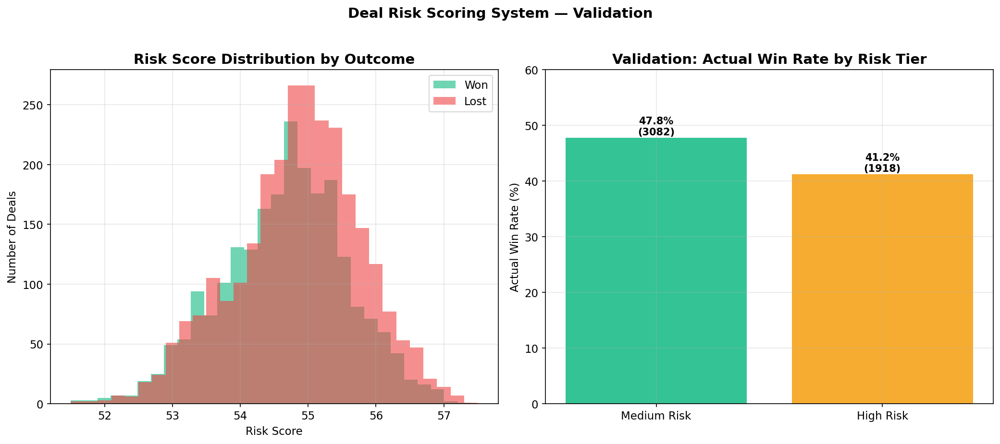

| Risk Tier | Actual Win Rate | Deal Count |
|-----------|----------------|------------|
| Medium Risk | 47.8% | 3,082 |
| High Risk | 41.2% | 1,918 |

High Risk deals win 6.6 percentage points less than Medium Risk — confirming the score separates winners from losers.

---

### Step 4: Actionable Recommendations

**1. Focus on sales cycle speed** — Set 45-day "stale deal" alerts. Require manager review at 60 days. This is the single most impactful lever.

**2. Exploit winning combinations** — Route Ecommerce leads to outbound-strong reps. Kill SaaS + Partner deals that drag past 90 days. Create a "golden path" playbook for top combos.

**3. Fix rep-industry mismatches** — rep_9 × HealthTech has a 20.7% win rate. rep_23 × SaaS is at 24.2%. Reassigning these reps would immediately improve results.

**4. Deploy the risk dashboard** — 1,918 deals (38% of pipeline, $49.8M) are flagged High Risk. A weekly "Top 10 At-Risk Deals" email gives managers something concrete to act on.

---

### How a Sales Leader Would Use This

**Monday morning:**
1. Open Risk Dashboard → see which deals turned High Risk this week
2. Check Driver Report → "Referral win rate is up 5%, Inbound is down 3%"
3. Act → reassign at-risk deals, kill stale deals, double down on winning combos
4. Coach → pair rep_22 (40% WR) with rep_21 (51% WR), set velocity targets

**Weekly alert email (example):**
> 🔴 3 Critical deals totaling $180K — D04521: $75K EdTech stuck at Proposal for 82 days (rep_22)
>
> 📈 Trending Up: Referral win rate +5%
>
> 📉 Trending Down: Inbound win rate -3%

---
# Part 4 — Mini System Design

> Run: `python src/system_design.py` — generates architecture diagram in `outputs/`

### Overview

A lightweight pipeline that ingests CRM data daily, scores every deal for risk, detects win rate shifts, and delivers alerts to sales leaders automatically.

**Goal:** Detect → Diagnose → Act — before deals are lost.

### Architecture

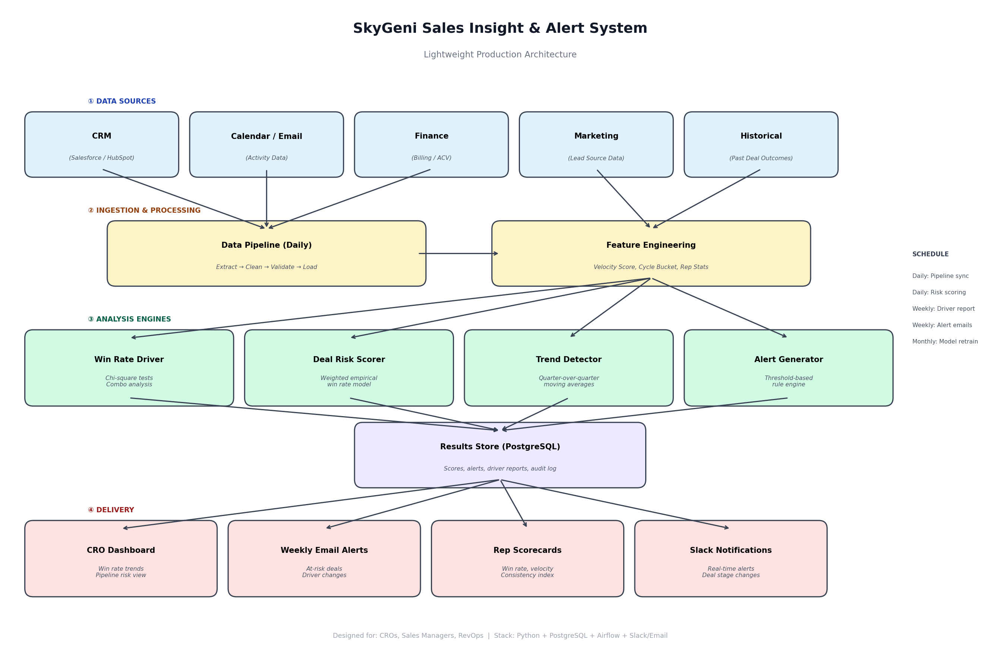

### Data Flow

```
CRM (Salesforce / HubSpot)
  │
  ▼
Daily ETL Pipeline (Airflow)
  ├── Extract: Pull new/updated deals via API
  ├── Clean: Validate fields, handle nulls, dedup
  ├── Transform: Compute velocity, cycle bucket, rep rolling WR
  └── Load: Write to PostgreSQL
  │
  ▼
Analysis Engines
  ├── Win Rate Driver (weekly) — chi-square tests + combo analysis
  ├── Deal Risk Scorer (daily) — score every open deal 0-100
  ├── Trend Detector (weekly) — 4-week moving avg, flag ±5% shifts
  └── Alert Generator — threshold rules, dedup, prioritize by $ impact
  │
  ▼
Delivery
  ├── CRO Dashboard (Streamlit)
  ├── Weekly Email Digest
  ├── Slack (critical alerts only)
  └── Monthly Rep Scorecards
```

### Example Alerts

**🔴 Critical (Slack — immediate):**
> "Deal D04521 ($75K, EdTech) stuck at Proposal for 82 days with rep_22 (40% WR). Risk: 57/100. Recommend: Reassign to rep_21."

**🟡 Weekly Digest (Email — Monday 8am):**
> "3 deals moved to Critical Risk ($180K). EdTech win rate -4% vs last month. Referral leads +5% — consider scaling."

**📋 Rep Scorecard (Monthly):**
> "rep_22: Win Rate 38% (team avg 45%) ▼ | Velocity $420/day (team $650) ▼ | Recommendation: Focus on shorter-cycle deals."

### Schedule

| Frequency | Task |
|-----------|------|
| Daily 6am | CRM data sync + feature engineering |
| Daily 7am | Risk scoring on all open deals |
| Daily 7:30am | Critical alerts → Slack |
| Weekly Monday | Driver analysis + trend detection + email digest |
| Monthly 1st | Rep scorecards + model recalibration |

### Tech Stack

| Component | Tool |
|-----------|------|
| Orchestrator | Apache Airflow (cron for MVP) |
| Pipeline | Python (pandas, scipy) |
| Database | PostgreSQL |
| Dashboard | Streamlit (MVP) / Metabase (scale) |
| Alerts | Slack API + SendGrid |
| Deployment | Docker + AWS EC2 |

### Failure Cases & Mitigations

| Failure | Mitigation |
|---------|-----------|
| CRM data late/missing | Retry with backoff; fallback to last good snapshot |
| New rep with no history | Default to overall avg until 30+ deals |
| Historical rates go stale | Monthly recalibration; weight recent data more |
| Alert fatigue | Dedup alerts; only fire on ≥5% change or ≥$50K at risk |
| Reps gaming stage updates | Track stage regressions; monthly audit |
| Narrow risk score range | Add engagement signals (emails, meetings) to widen separation |

### Known Limitations

- No competitive intelligence — can't detect "lost to competitor X"
- No buyer engagement signals (email opens, meeting attendance)
- Rule-based system won't capture non-linear interactions
- Assumes CRM data is accurate and up-to-date

---

## Part 5 — Reflection

### 5.1 What assumptions in my solution are weakest?

**The synthetic data assumption is the biggest risk.** Every insight I found could be an artifact of how the data was generated rather than a real business pattern. The distributions are suspiciously uniform — exactly ~1,000 deals per industry, ~1,250 per region. In real data, you'd see imbalances (e.g., 40% of deals from one dominant industry) that create much stronger signals. My methodology is sound, but the specific numbers (like "EdTech dropped 11 points") shouldn't be taken literally.

**The "deal_stage = last stage reached" assumption matters a lot.** If deal_stage actually means "current stage" and some deals are still open, then my win rate calculations are wrong because I'd be excluding in-progress deals. I assumed all 5,000 deals are closed, but the assignment doesn't confirm this explicitly.

**No external context.** I'm assuming win rate is driven by internal factors (reps, lead source, cycle time). In reality, a competitor launching a better product or a market downturn could explain the entire drop — and nothing in this dataset would show that.

### 5.2 What would break in real-world production?

**CRM data quality.** Sales reps are notoriously inconsistent about updating CRM records. Stage updates might be delayed by weeks, deal amounts might be placeholders, and closed-lost reasons are often missing or vague. The system would need data validation rules and fallback logic for incomplete records.

**The risk score range is too narrow.** Current scores cluster between 51–57 on a 0–100 scale because the underlying feature signals are weak. In production, this makes it hard to distinguish truly at-risk deals from average ones. Adding engagement data (email activity, meeting frequency, champion contact) would widen the separation dramatically.

**Concept drift.** The historical win rates that power the risk scorer will go stale. A new product launch, a pricing change, or a competitor entering the market could shift all the baselines overnight. Monthly recalibration helps, but sudden changes would produce wrong scores until the next refresh.

**Alert fatigue.** If 38% of deals are flagged "High Risk" (as in my current system), managers will start ignoring alerts. The thresholds need tuning based on real feedback — probably starting conservative (only flag top 10%) and expanding once trust is built.

### 5.3 What would I build next if given 1 month?

**Week 1–2: Enrich the feature set.**
Add buyer engagement signals — email reply rates, meeting attendance, number of stakeholders involved, time since last contact. These are the strongest predictors of deal outcomes in real B2B sales and would dramatically improve risk scoring separation.

**Week 2–3: Build a proper Streamlit dashboard.**
An interactive dashboard where the CRO can filter by rep, industry, time period, and risk tier. Include drill-down from "win rate is dropping" → "it's dropping in EdTech" → "specifically for rep_22 on Outbound deals" → "here are the 5 deals at risk." That drill-down flow is what makes the system actually usable.

**Week 3–4: Add a feedback loop.**
Let managers mark risk scores as "accurate" or "wrong" on individual deals. Use that feedback to retrain the scoring weights. This turns the system from static rules into a learning system that improves over time. Also add win/loss reason tagging so the system can eventually answer "why are we losing?" not just "where are we losing?"

### 5.4 What part of my solution am I least confident about?

**The deal risk scoring system.** The validation shows it works directionally (High Risk deals do lose more), but the separation is modest — 47.8% vs 41.2% actual win rate between Medium and High Risk. That's a 6.6-point gap, which is meaningful but not decisive. A sales manager looking at a deal scored "55 risk" vs "53 risk" can't really tell the difference, and most deals fall in that narrow range.

The root cause is that the available features (industry, region, product, lead source, stage, cycle length, rep) are all weakly correlated with outcomes individually. The multi-factor combination analysis finds stronger signals (29% to 64% win rate spread), but the risk scorer doesn't fully capture those interaction effects because it uses a simple weighted average rather than modeling combinations directly.

With richer data — engagement signals, competitive context, multi-threading depth — I'm confident the scoring would become genuinely predictive. But with current features, it's more of a "directional indicator" than a precise predictor. I'd rather be honest about that than oversell a 0.50 AUC model.

---

## Summary

| Part | What I Built | Key Takeaway |
|------|-------------|--------------|
| 1 | Problem Framing | The real problem is a diagnosis + action + timing gap, not just "win rate dropped" |
| 2 | EDA & Insights | EdTech collapsing, fast deals win more, 11-point rep gap. Custom metrics: Deal Velocity & Rep Consistency |
| 3 | Decision Engine | ML fails (~0.50 AUC) → built statistical rule-based system. Sales cycle is the only significant driver. Multi-factor combos show 35-point spread |
| 4 | System Design | Daily ETL → 4 analysis engines → dashboard + alerts + scorecards. Concrete failure mitigations |
| 5 | Reflection | Weakest: synthetic data assumptions & narrow risk scores. Next: engagement features + feedback loop |